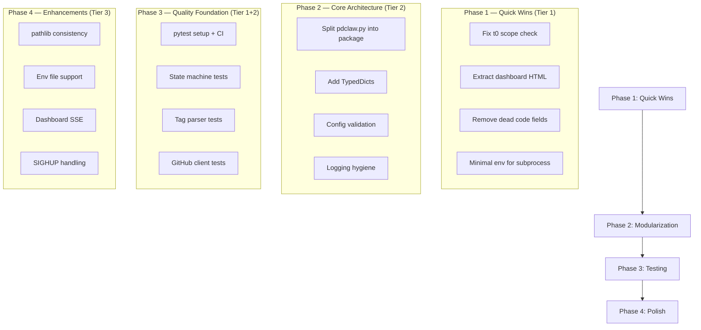

# PDClaw Codebase Review — Enhancement Design

## 1. Executive Summary

This design document presents findings from a comprehensive review of the PDClaw codebase
(commit `075fdf4`). The review covers ~3,000 lines of Python across 6 modules plus skill
definitions and documentation. A total of **21 enhancement opportunities** have been identified,
categorized into three tiers based on impact and urgency. The enhancements range from
architectural improvements (modularization, type safety) to quality-of-life fixes (error
handling, logging hygiene, dead code removal).

---

## 2. Functional Design

The current system has no functional defects — the PDCA cycle automation works as described
in the README. The enhancements below address **maintainability, reliability, observability,
and developer experience**, not end-user features.

### 2.1 Tier 1 — Recommended (high impact, low risk)

| # | Enhancement | Rationale |
|---|-------------|-----------|
| 1 | **Extract Dashboard HTML into a separate file** | The 196-line raw string `_DASHBOARD_HTML` in `pdca_dashboard.py:26` is unmaintainable. Syntax errors in HTML/JS/CSS are invisible to Python tooling. Extract to `pdca_dashboard.html` with server-side inclusion. |
| 2 | **Fix fragile `t0` scope check** | `pdclaw.py:908` uses `if 't0' in dir()` in the `except` block of the session-execution try. This is unconventional and brittle — `t0` may reference a stale variable from a previous successful session call. Assign `t0 = 0.0` before the try block instead. |
| 3 | **Add unit/integration tests** | Zero tests exist. No test framework in `requirements.txt`. The state machine logic (`resolve_next_step`, `has_new_activity`, tag parsing) and GitHub API client are high-risk, regression-prone areas. Minimum: pytest + doctest for pure functions. |
| 4 | **Audit environment variable leakage** | The `claude` subprocess (`pdclaw.py:938-939`) inherits all parent env vars via `env=os.environ.copy()`. This includes `GITHUB_TOKEN` and `DEEPSEEK_API_KEY`. The stateless mode at line 916 uses the same pattern. Construct a minimal env dict. |
| 5 | **Replace `dir()` usage in metrics fallback** | `pdclaw.py:907` uses `dir()` to check if local variable exists. Replace with explicit initialization or a sentinel pattern. |
| 6 | **Remove dead `frequent_issues` field** | `pdca_memory.py:66` initializes `frequent_issues: []` in the global memory template. No code anywhere populates or reads this field. |

### 2.2 Tier 2 — Recommended (moderate impact)

| # | Enhancement | Rationale |
|---|-------------|-----------|
| 7 | **Modularize `pdclaw.py`** | At 2,107 lines, `pdclaw.py` handles: config loading, signal handling, GitHub API, tag parsing, state machine, activity detection, context building, skill execution, branch management, git operations, CLI parsing, polling loop. Extract the GitHub client, tag engine, state machine, and git operations into separate modules. |
| 8 | **Add TypedDicts for GitHub API responses** | `_GitHubClient` returns raw `dict` objects. TypedDicts (or dataclasses) for Issue, Comment, and User would eliminate magic string key lookups and enable IDE autocompletion. |
| 9 | **Replace `logger.warning(f"...")` with lazy formatting** | Several log calls use f-strings instead of `%s`-style lazy formatting, defeating the lazy-evaluation optimization (e.g., `log.warning(f"Corrupted issue memory for #{issue_number}")` in `pdca_memory.py:145`). |
| 10 | **Unify Chinese/English comments** | `pdca_claude_session.py`, `pdca_metrics.py`, `pdca_dashboard.py` have Chinese docstrings in an English-language codebase. Inconsistent. |
| 11 | **Document `/new-refresh` command** | `pdclaw.py:89` matches `/new-refresh` in comments via `NEW_SESSION_RE`, but this command is undocumented anywhere (README, SESSION_MODE.md, etc.). Either document it or remove it. |
| 12 | **Add config validation on startup** | `config.ini` values are read without validation. Invalid `interval="abc"` would produce a cryptic `ValueError`. Validate after parsing. |
| 13 | **Improve `has_new_activity` noise filtering** | The regex-based meaningful-input filter (`MEANINGFUL_INPUT_PATTERNS` at line 346) matches very broad terms like "yes", "no", "?", "fix". This may misclassify noisy comments as meaningful. | 
| 14 | **Add signal handling for `SIGHUP`** | Only `SIGINT` and `SIGTERM` are handled. `SIGHUP` should trigger a graceful reload or shutdown for daemon deployments. |

### 2.3 Tier 3 — Nice to have (lower impact)

| # | Enhancement | Rationale |
|---|-------------|-----------|
| 15 | **Use `pathlib` consistently** | Some path operations still use string concatenation instead of `Path` operators (e.g., `pdca_claude_session.py:230` constructs a path with `Path(".pdca_state") / str(issue_number) / ...` mixed with string formatting). |
| 16 | **Thread-safe `_memory` access** | The module-level `_memory` singleton in `pdclaw.py:94-95` is accessed without locks, but `_inject_memory_into_skill` at line 759 is called from a synchronous polling loop. Only a risk if multi-threading is added. Future-proof with a local. |
| 17 | **Add `.env` support** | Credentials must be exported as env vars. Using `python-dotenv` to load `.env` files would improve developer experience. |
| 18 | **Dashboard SSE endpoint** | The `/api/log` endpoint at `pdca_dashboard.py:249-256` returns empty content. Implementing Server-Sent Events for log streaming would make the dashboard useful for real-time monitoring. |
| 19 | **Progress indicator for long AI calls** | `python-dotenv` for env vars | `pdclaw.py` and skills |
| 20 | **GitHub API pagination timeout** | `get_issue_comments` and `list_open_issues` paginate with `per_page=100` but have no per-page timeout. A single slow API response blocks the entire polling cycle. Add request timeout per page. |

---

## 3. Architecture Design

### Current Architecture

```
pdclaw.py (2107 lines)          ← single file, all concerns
├── Config / CLI
├── GitHub API client
├── Tag parsing engine
├── State machine
├── Activity detection
├── Context builder
├── Skill executor
├── Git operations
└── Main polling loop

Supporting modules:
├── pdca_memory.py          ← OK, well-encapsulated (367 lines)
├── pdca_memory_cli.py      ← OK, thin CLI wrapper (217 lines)
├── pdca_claude_session.py  ← OK, focused (241 lines)
├── pdca_metrics.py         ← OK, focused (257 lines)
└── pdca_dashboard.py       ← Dashboard HTML embedded as string (312 lines)
```

### Proposed Modularization (Tier 2, #7)

```
pdclaw/
├── __init__.py
├── main.py                    ← Entry point, polling loop, signal handling
├── config.py                  ← Config loading + validation
├── github_client.py           ← GitHub API client with TypedDicts
├── tag_engine.py              ← Tag parsing, step resolution
├── state_machine.py           ← State loading/saving, activity detection
├── skill_executor.py          ← Skill loading, memory injection, AI dispatch
├── git_ops.py                 ← Branch creation, commit, push, deploy
├── context.py                 ← Context consolidation (issue + comments)
├── session_manager.py         ← (currently pdca_claude_session.py)
├── memory.py                  ← (currently pdca_memory.py)
├── memory_cli.py              ← (currently pdca_memory_cli.py)
├── metrics.py                 ← (currently pdca_metrics.py)
├── dashboard.py               ← (currently pdca_dashboard.py)
│                               ← dashboard HTML → separate template file
└── constants.py               ← Tag names, step names, defaults
```

This preserves backward compatibility — `pdclaw.py` would become a thin re-export wrapper
or a symlink to the package.

---

## 4. Technical Design

### 4.1 Proposed Implementation Order



### 4.2 Technology Choices

- **Testing**: pytest (no additional dependency beyond `requests`)
- **Dashboard template**: plain HTML file served by the existing `BaseHTTPRequestHandler`
- **No new external dependencies** — all changes use stdlib

### 4.3 Backward Compatibility

All enhancements maintain backward compatibility:
- Config file format unchanged
- CLI interface unchanged
- Generated file format unchanged
- State file format unchanged
- Memory file format unchanged
- Git branch naming unchanged

---

## 5. UI Design

No user-facing UI changes are proposed. The dashboard (Tier 2, #18) may gain real-time
log streaming via SSE, but the existing `/api/status` endpoint remains intact.

---

## 6. Other Considerations

### 6.1 Security
- **Tier 1, #4**: Subprocess env cleanup reduces credential leakage risk.
- Password/API key handling in the claude subprocess will continue to use env variables.

### 6.2 Performance
- Modularization will not change performance characteristics.
- No change to the polling loop or AI call frequency.

### 6.3 Observability
- Session summary truncation at 500 chars (`pdca_claude_session.py:168-169`) may lose context.
- Consider configurable truncation width or a summary-only mode.

### 6.4 Risk Assessment
| Risk | Likelihood | Impact | Mitigation |
|------|-----------|--------|------------|
| Modularization breaks imports | Low | High | Keep re-exports in `pdclaw.py`, test with `--once` |
| Dashboard HTML extraction breaks | Low | Medium | Serve from file, fallback to embedded default |
| Subprocess env change breaks AI | Low | High | Test with minimal env, add logging of missing keys |

---

## 7. Outstanding Questions

1. **Modularization scope**: Should we keep `pdclaw.py` as a backward-compatible entry point
   (file grows but adds re-exports), or fully migrate to a package structure with a console
   script entry point?

2. **Dashboard template location**: Should the HTML template go in `skills/`, a new `templates/`
   directory, or alongside `pdca_dashboard.py`?

3. **Testing strategy**: Integration tests require a real GitHub repo or a mock server. What
   level of mocking is acceptable for CI? Recommend `responses` or `pytest-httpserver`?

4. **`.env` support**: Adding `python-dotenv` introduces an optional dependency. Should we
   add it to `requirements.txt` or keep it fully external?

5. **Logging language**: Should all Chinese docstrings/comments be translated to English, or
   kept as-is for Chinese-speaking contributors?
